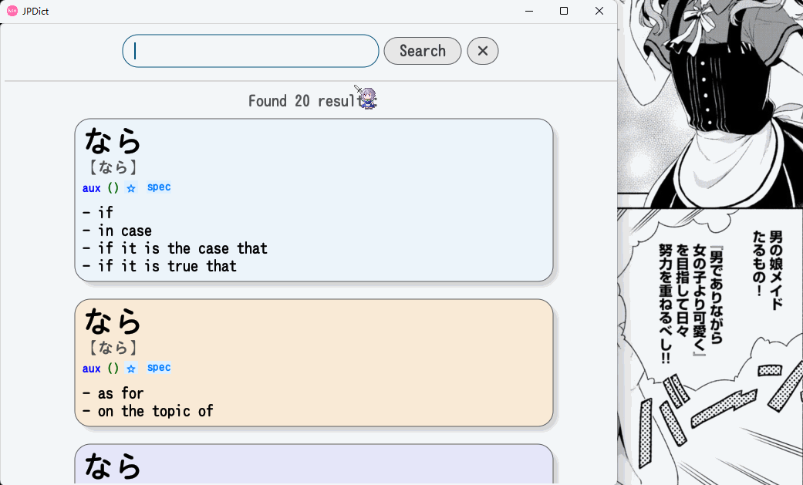

# JPDict

JPDict is a Japanese dictionary application built using Rust and eframe.



## Table of Contents

- Installation
- Usage
- Project Structure
- Database
- Dictionary Entries
- User Interface
- Search Functionality
- License

## Installation

To install JPDict, clone the repository and build it using Cargo:

```bash
git clone https://github.com/yourusername/jpdict.git
cd jpdict
cargo build --release
```

## Usage

To run JPDict, use the following command:
```bash
cargo run --release
```

## Project Structure

The project is organized into the following modules:

- `src/main.rs`: The main entry point of the application.
- `src/db.rs`: Functions for initializing and populating the database.
- `src/dictionary.rs`: Defines the structure of dictionary entries.
- `src/ui.rs`: Manages the user interface using the eframe crate.

## Database

The database is initialized and populated with Japanese dictionary entries from JSON files. It uses SQLite for storage.

### Initialization

The database is initialized with the following schema:

```sql
CREATE TABLE IF NOT EXISTS dictionary (
    id INTEGER PRIMARY KEY,
    word TEXT NOT NULL,
    reading TEXT NOT NULL,
    pos TEXT NOT NULL,
    inflection TEXT NOT NULL,
    freq INTEGER NOT NULL,
    translations TEXT NOT NULL,
    sequence INTEGER NOT NULL,
    tags TEXT NOT NULL,
    pronunciation TEXT NOT NULL
);
```

### Population

The database is populated from JSON files located in the `assets` directory. Each file contains an array of dictionary entries.

## Dictionary Entries

Dictionary entries are structured as follows:

```rust
#[derive(Clone)]
#[derive(Debug, Serialize, Deserialize)]
pub struct DictionaryEntry {
    pub word: String,
    pub reading: String,
    pub pos: String,
    pub inflection: Option<String>,
    pub freq: i32,
    pub translations: Vec<String>,
    pub sequence: i32,
    pub tags: Option<String>,
    pub pronunciation: String,
}
```

## User Interface

The user interface is built using eframe and egui, providing a simple and intuitive way to search for and view dictionary entries.

### Search Bar

The search bar allows users to enter a query to search the dictionary.

### Search Results

Search results are displayed in a scrollable list, with each result showing the word, reading, part of speech, inflection, frequency, tags, and translations.

## Search Functionality

The search functionality is implemented with the following features:

- Search by word, reading, translations, or pronunciation.
- Results are scored based on relevance and frequency.
- Pagination is supported to handle large result sets.

## License

This project is licensed under the MIT License.
